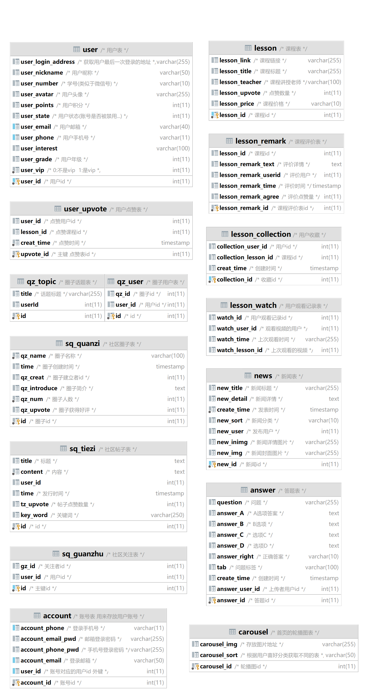

## 智能享学

#### 介绍
智能享学APP前端仓库

#### 项目功能
##### 首页：轮播、主要功能区（ai智能交流、智能识别、问答测验、知识科普、深度体验）、课堂推荐区、新闻推荐区
##### 课堂：精选好课、相关推荐、好书推荐
##### 社区：关注、推荐、圈子、发布
##### 用户：登录注册、修改信息、足迹、收藏、学习数据可视化

#### 参与成员
##### 1、徐宇航：后端API开发、数据库设计、前端功能完善
##### 2、杨楹贝：前端样式和功能开发
##### 3、钟佳琪：资料收集、数据库内容填充，接口测试

#### 项目结构

